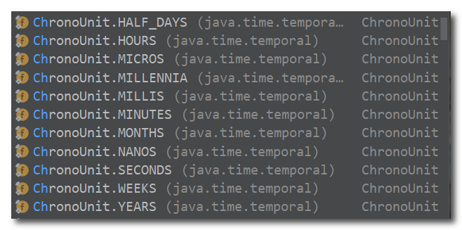

## SpringBoot开发篇

### 1. 热部署

##### 手动热部署

首先导入开发者工具对应的坐标

```xml
<dependency>
    <groupId>org.springframework.boot</groupId>
    <artifactId>spring-boot-devtools</artifactId>
    <scope>runtime</scope>
    <optional>true</optional>
</dependency>
```

然后使用IDEA顶部工具栏Build中的Build Project重新部署项目，或者使用快捷键`Ctrl+F9`


**重启与重载**

一个springboot项目在运行时实际上是分两个过程进行的，根据加载的东西不同，划分成base类加载器与restart类加载器。

- base类加载器：用来加载引入jar包中的类，jar包中的类和配置文件不会发生变化。
- restart类加载器：用来加载开发者自己开发的类、配置文件、页面等信息，这一类文件受开发者影响。

当springboot项目启动时，base类加载器执行，加载jar包中的信息后，restart类加载器执行，加载开发者制作的内容。当执行构建项目后，由于jar中的信息不会变化，因此base类加载器无需再次执行，所以仅仅运行restart类加载器，也就是将开发者自己制作的内容重新加载，这就完成了一次热部署的过程。而重启项目后是将base加载器和restart加载器都重新加载，这更耗时。


##### 自动热部署

在settings中找到『Build』，然后找到『Compile』，然后勾选『Build project automatically』


然后在settings中找到『Advanced Settings』，然后在Compile中勾选『Allow auto-make to start...』


设置完成后，当代码有变化时，IDEA在失去焦点5秒后就会自动部署，这样就完成了自动热部署。


##### 热部署监控范围

通过修改项目中的文件，可以发现其实并不是所有的文件修改都会激活热部署的，原因在于在开发者工具中有一组配置，当满足了配置中的条件后，才会启动热部署，配置中默认不参与热部署的目录信息如下：

- /META-INF/maven
- /META-INF/resources
- /resources
- /static
- /public
- /templates

以上目录中的文件如果发生变化，是不参与热部署的。可以通过application.yml文件进行设定哪些文件不参与热部署操作：

```yaml
spring:
  devtools:
    restart:
      # 设置不参与热部署的文件或文件夹，**表示该目录下的所有文件
      exclude: static/**,public/**,config/application.yml
```


##### 关闭热部署

关闭热部署功能降低线上程序的资源消耗。

*通过配置文件关闭热部署：*

```yaml
spring:
  devtools:
    restart:
      enabled: false
```

*或者通过设置系统属性关闭热部署：*

```java
@SpringBootApplication
public class DeployApplication {
    public static void main(String[] args) {
        // 设置系统属性关闭热部署
        System.setProperty("spring.devtools.restart.enabled","false");
        SpringApplication.run(DeployApplication.class);
    }
}
```

当上述设置都不起效时，那就是还有更高优先级的配置开启了热部署。

------


### 2. 配置属性

##### 读取属性

###### *@ConfigurationProperties*

之前就学习了@ConfigurationProperties注解，此注解的作用是为bean中的属性注入配置文件中一个对象的属性值。

@ConfigurationProperties中prefix(或者value)的值只能是纯小写字母，只要出现大写字母就会报错。这是SpringBoot规定的。

**注意**：该注解可以使用在类或方法上，使用@ConfigurationProperties注解的〔类〕或〔方法返回的bean〕必须被被spring管理。

首先需要在yaml配置文件中以对象的格式添加若干属性。

```yaml
# 这是一个自定义的myServer对象
myServer:
  ip-address: 192.168.0.1 
  port: 2345
  timeout: -1
```

然后定义一个实体类并交由Spring管理

> 使用@Date为我们提供getter和setter。（注入属性值是依赖setter方法注入的）
>
> 使用@ConfigurationProperties(prefix ="myserver")为我们注入配置文件中myServer对象的属性。prefix的值必须全部小写。

```java
@Component
@Data
@ConfigurationProperties(prefix = "myserver")
public class MyServer {
    private String ipAddress;
    private int port;
    private long timeout;
}
```

使用@ConfigurationProperties注解也可以为第三方bean加载属性

```yaml
datasource:
  driverClassName: com.mysql.jdbc.Driver666
```

```java
// 该方法返回的bean必须被spring管理
@Bean
// 给第三方bean注入属性
@ConfigurationProperties(prefix = "datasource")
public DruidDataSource dataSource(){
    DruidDataSource dataSource = new DruidDataSource();
    return dataSource;
}
```

在主程序类中打印注入的属性：

```java
public static void main(String[] args) {
    ConfigurableApplicationContext context = SpringApplication.run(ConfigurationApplication.class, args);
    MyServer myServer = context.getBean(MyServer.class);
    System.out.println(myServer);
    DruidDataSource dataSource = context.getBean(DruidDataSource.class);
    System.out.println(dataSource.getDriverClassName());
}
```


###### *@EnableConfigurationProperties*

@ConfigurationProperties这个注解不仅可以写在类上，还可以写在方法上，所以找起来就比较麻烦了。

为了解决这个问题，spring给我们提供了一个全新的注解 `@EnableConfigurationProperties`。

该注解专门标注使用@ConfigurationProperties注解绑定属性的bean被Spring管理。**该注解使用在启动类上**。

使用该注解后，@ConfigurationProperties修饰的类或方法就可以不用添加@component或者@Bean了。

下面是自定义类MyServer：

```Java
@Data
// 无需再声明被Spring管理
@ConfigurationProperties(prefix = "myserver")
public class MyServer {
    private String ipAddress;
    private int port;
    private long timeout;
}
```

下面是SpringBoot启动类：

```Java
@SpringBootApplication
// 指定@ConfigurationProperties修饰的MyServer类被spring管理
@EnableConfigurationProperties(MyServer.class)
public class ConfigurationApplication {}
```


##### 松散绑定

@ConfigurationProperties绑定属性时支持属性名宽松绑定，这个宽松体现在属性名的命名规则上。@Value注解不支持松散绑定规则。

比如下面的配置属性的命名有多种模式：

```yaml
#给@ConfigurationProperties注解使用的属性有多种命名模式
#myServer   # 小驼峰模式
#MY_SERVER  # 常量模式
#my_server  # 下划线模式
#m-Y_SerVer	# 狂野模式（乱七八糟）
my-server:  # 烤肉串模式
  # 当然其中的属性也能这样命名
  # ip-address: 192.168.0.1
  ipAddress: 192.168.0.1
  port: 8888
  timeout: -1
# 配置中的名称最终会去掉中划线和下划线且忽略大小写，然后与java代码中的属性名忽略大小等值匹配
```

使用@ConfigurationPropertiesb绑定的时候prefix的值只能使用纯小写模式或者烤肉串模式，否则报错

> 比如：`@ConfigurationProperties(prefix = "myserver")` 或者 `@ConfigurationProperties(prefix="my-server")`
>
> 不管配置文件中怎么写，绑定的时候都只能这样绑定。

下面为使用下划线模式报错的情况：


##### 计量单位绑定

springboot充分利用了JDK8中提供的全新的用来表示计量单位的新数据类型，分别是Duration和DataSize。

**Duration**：表示时间间隔类型，单位默认是毫秒。可以通过@DurationUnit注解描述时间单位

**DataSize**：表示存储空间类型，单位默认是字节。可以通过@DataSizeUnit注解描述存储空间单位。


###### *@DurationUnit*

> 描述时间单位。例如单位为小时：@Duration(ChronoUnit.HOURS)

常用时间单位：



###### *@DataSizeUnit*

> 描述存储空间单位。例如单位为MB：@DataSize(DataUnit.MEGABYTES）

常用单位：


下面定义两个新变量

```Java
// 下面定义两个新类型的变量
private Duration serverTimeOut;	// 定义一个时间间隔类型的变量，单位默认为毫秒
private DataSize dataSize;  // 存储空间大小类型，单位默认为Byte
```

```yaml
myServer:
  ipAddress: 192.168.0.1
  port: 8888
  timeout: 100
  serverTimeout: 10
  dataSize: 100
```

读取配置文件中的值，观察结果可以发现10确实为10毫秒（输出的时候会以秒显示），100是100字节。


也可以在配置文件中携带单位，最终会转化成它默认的单位

```yaml
 dataSize: 100MB	# 注意单位不能随便写，B、KB、MB、GB
```


通过@DurationUnit和@DataSizeUnit注解指定单位

```Java
@DurationUnit(ChronoUnit.HOURS)	// 指定单位为小时
private Duration serverTimeOut; 
@DataSizeUnit(DataUnit.MEGABYTES) // 指定单位为MB
private DataSize dataSize;  
```

```yaml
  serverTimeout: 10
  dataSize: 1
```

观察结果，10表示10小时，1表示1MB但最终会以字节数显示。


##### 数据校验

首先导入数据校验相关依赖

```xml
<dependency>
    <groupId>org.springframework.boot</groupId>
    <artifactId>spring-boot-starter-validation</artifactId>
</dependency>
```

###### *@Validated*

在需要开启校验功能的类上使用注解`@Validated`开启校验功能

```Java
@Data
@ConfigurationProperties(prefix = "my-server")
@Validated	//开启对当前bean的属性注入校验
public class MyServer {
    private String ipAddress;
    //设置具体的校验规则
    @Max(value = 8888,message = "最大值不能超过8888")
    @Min(value = 1000,message = "最小值不能低于1000")
    private int port;
}
```

将配置文件中的port值设置为8889查看结果


还有很多类似@Max、@Min的注解，比如@NotEmpty


##### 属性值的格式


------


### 3. 测试

##### 加载测试专用属性

`@SpringBootTest`注解中有两个属性用于传入临时参数，分别是`properties`和`args`

###### 使用properties加载

在`@SpringBootTest`注解中使用`properties`属性为当前测试用例添加临时的属性配置，然后使用@Value注解读取参数。

```Java
@SpringBootTest(properties = {"test.prop=testValue"})
class TestApplication {
    @Value("${test.prop}")
    private String val;
    @Test
    void testProperties() {
        System.out.println(val);
    }
}
```

###### 使用args加载

在`@SpringBootTest`注解中使用`args`属性为当前测试用例添加临时的命令行参数。注意格式为命令行的格式！

```Java
@SpringBootTest(args = {"--test.prop=testValue"})
class TestApplication {
    @Value("${test.prop}")
    private String val;
    @Test
    void testProperties() {
        System.out.println(val);
    }
}
```

args属性配置优先级比properties属性配置高。


##### 加载测试专用配置类

首先使用@Configurat注解定义一个配置类

```java
@Configuration
public class MyConfig {
    @Bean
    public DruidDataSource dataSource(){
        return new DruidDataSource();
    }
}
```

使用@Import注解导入配置类，使用方式：@Import(Class clazz)，多个配置类写成数组形式{}。

```java
@SpringBootTest
@Import(MyConfig.class)
class TestApplication {
    @Autowired
    private DruidDataSource dataSource;

    @Test
    void testConfiguration(){
        System.out.println(dataSource);
}
```


##### Web环境模拟测试

###### *webEnvironment*

`@SpringBootTest`注解中有一个叫做`webEnvironment`，通过该属性就可以设置在测试用例中启动web环境。

使用方式：`@SpringBootTest(webEnvironment = SpringBootTest.WebEnvironment.RANDOM_PORT)`

测试类中启动web环境时，springboot提供了4种设置值：

- `MOCK`：根据当前设置确认是否启动web环境，例如使用了Servlet的API就启动web环境，属于适配性的配置
- `DEFINED_PORT`：使用自定义的端口作为web服务器端口
- `RANDOM_PORT`：使用随机端口作为web服务器端口
- `NONE`：不启动web环境

###### *@AutoConfigureMockMvc*

使用`@AutoConfigureMockMvc`注解开启web虚拟调用功能，该注解会为我们提供`MockMvc`对象。

创建`MockHttpServletRequestBuilder`对象封装请求，`MockMvc`对象调用`perform()`方法发送请求。

perform()方法返回一个`ResultActions`对象，该对象调用`andExpect()`方法将预期结果与真实结果匹配。

```Java
// 开启测试环境下的web环境并使用随机端口
@SpringBootTest(webEnvironment = SpringBootTest.WebEnvironment.RANDOM_PORT)
// 开启web虚拟调用功能，它会为我们提供MockMvc对象
@AutoConfigureMockMvc
public class TestController {
    @Test
    void testWeb(@Autowired MockMvc mvc) throws Exception {
        // 创建一个虚拟请求对象，封装请求的路径
        MockHttpServletRequestBuilder builder = MockMvcRequestBuilders.get("/hello");
        // 使用MockMVC对象调用perform()方法发送对应请求，该方法返回一个ResultActions对象。
        ResultActions actions = mvc.perform(builder);

        //设定预期值与真实值进行匹配，成功测试通过，失败则报错
        /* 下面为响应状态匹配 */
        // 创建状态对象
        StatusResultMatchers status = MockMvcResultMatchers.status();
        // 定义本次请求的预期状态:isOk表示状态200
        ResultMatcher ok = status.isOk();
        // 将预期状态与本次请求结果匹配
        actions.andExpect(ok);

        /* 下面为响应体匹配（非JSON数据） */
        // 创建内容对象
        ContentResultMatchers content = MockMvcResultMatchers.content();
         //定义本次请求的预期内容“hello”
        ResultMatcher string = content.string("hello");
         //将预期内容与本次结果匹配
        actions.andExpect(string);

        /* 下面为响应体匹配（JSON数据） */
        // 创建内容对象
        ContentResultMatchers content2 = MockMvcResultMatchers.content();
        // 定义本次请求的预期内容
  ResultMatcher json = content2.string("{\"title\":\"SpringBoot\",\"type\":\"computer\",\"price\":99.9}");
        // 将与其内容与本次结果匹配
        actions.andExpect(json);

        /* 下面为响应头信息匹配 */
        HeaderResultMatchers header = MockMvcResultMatchers.header();
        ResultMatcher contentType = header.string("Content-Type", "application/json");
        actions.andExpect(contentType);
    }

}
```

下面展示匹配失败的情况：


##### 数据层测试回滚

test生命周期属于必须被运行的生命周期，如果跳过会给系统带来极高的安全隐患，所以测试用例必须执行。

如果测试时产生了事务提交就会在测试过程中对数据库数据产生影响，进而产生垃圾数据。

只要注解@Transactional出现的位置存在注解@SpringBootTest，springboot就会认为这是一个测试程序，无需提交事务。

如果想在测试类中提交事务，也可以再添加一个@RollBack的注解，设置回滚状态为false即可正常提交事务。

```Java
@SpringBootTest
// 在测试类中使用@Transactional注解表示不会提交事务，事务会进行回滚。
// 如果数据库中的id自增，id会加1，因为id是数据库管理的，但是数据不会写入数据库。
@Transactional
// Rollback的值默认就是true，表示回滚事务。如果改为false，那么会提交事务。
@Rollback(true)
public class BookServiceTest {
    @Autowired
    private BookService bookService;
    @Test
    void testSave(){
        Book book = new Book();
        book.setName("springboot");
        book.setType("springboot");
        book.setDescription("springboot");
        bookService.save(book);
    }
}
```


##### 随机测试数据

springboot提供了在配置中使用随机值的机制，确保每次运行程序加载的数据都是随机的。具体如下：

- `${random.int}`	随机整数
- `${random.int(10)}`	10以内随机整数
- `${random.int(10,20)}`	10-20之间的随机整数，括号只是一个分隔符，也可以用其他符号，比如@10,20@
- `${random.value}`	随机MD5字符串（32位）
- `${random.uuid}`	随机uuid（唯一的）
- `${random.long}`	随机整数（long范围内）

在配置文件中设置随机值：

```yml
testdata:
  num: ${random.int}
  num2: ${random.int(10,20)}
  str: ${random.value}
  uuid: ${random.uuid}
  milliseconds: ${random.long}
```

设置模型类封装这些数据：

```Java
@Data
@Component
@ConfigurationProperties(prefix = "test-data")
public class TestData {
    private int num;
    private int num2;
    private String str;
    private String uuid;
    private long milliseconds;
}
```

打印模型类对象：

```
TestData(num=1147552752,num2=19,str=21c1ce2f03e1041d41d9109f177d4e2a, uuid=8332b081-4050-4798-b9b3-9b9e151e56b4,milliseconds=5100295753557205224)
```


### 4. 数据层解决方案

##### 数据源技术

springboot提供了3款内嵌数据源技术，分别如下：

- Hikari（默认）
- Tomcat提供DataSource
- Commons DBCP

使用默认数据源Hikari的配置：

```yml
spring:
  datasource:
    url: jdbc:mysql://localhost:3306/mybatis?serverTimezone=UTC
    driver-class-name: com.mysql.cj.jdbc.Driver
    username: root
    password: root
```

也可以写成对hikari做的单独配置，但是url地址要单独配置：

```yml
spring:
  datasource:
    url: jdbc:mysql://localhost:3306/mybatis?serverTimezone=UTC
    hikari:
      driver-class-name: com.mysql.cj.jdbc.Driver
      username: root
      password: root
      maximum-pool-size: 50
```


##### 持久化技术

SpringBoot推荐使用jdbcTemplate技术来操作数据库。

开发中一般不用jdbcTemplate，而是使用MyBatis、MyBatisPlus、Hibernate框架。

下面使用jdbcTemplate技术回归到jdbc最原始的编程形式来进行数据层的开发

(1) 导入jdbc对应的stater：

```xml
<dependency>
    <groupId>org.springframework.boot</groupId>
    <artifactId>spring-boot-starter-jdbc</artifactId>
</dependency
```

(2) 自动装配JdbcTemplate对象

```java
@SpringBootTest
class JdbcTemplateTests {
    @Test
    void testJdbcTemplate(@Autowired JdbcTemplate jdbcTemplate){
    }
}
```

(3) 使用JdbcTemplate实现查询操作（非实体类封装数据的查询操作）

```java
@Test
void testJdbcTemplate(@Autowired JdbcTemplate jdbcTemplate){
    String sql = "select * from tb_book";
    List<Map<String, Object>> maps = jdbcTemplate.queryForList(sql);
    System.out.println(maps);
}
```

(4) 使用JdbcTemplate实现查询操作（实体类封装数据的查询操作）

```java
@Test
void testJdbcTemplate(@Autowired JdbcTemplate jdbcTemplate){

    String sql = "select * from tbl_book";
    RowMapper<Book> rm = new RowMapper<Book>() {
        @Override
        public Book mapRow(ResultSet rs, int rowNum) throws SQLException {
            Book book = new Book();
            book.setId(rs.getInt("id"));
            book.setName(rs.getString("name"));
            book.setType(rs.getString("type"));
            book.setDescription(rs.getString("description"));
            return book;
        }
    };
    List<Book> list = jdbcTemplate.query(sql, rm);
    System.out.println(list);
}
```

(5) 使用JdbcTemplate实现修改操作

```java
@Test
void testJdbcTemplateSave(@Autowired JdbcTemplate jdbcTemplate){
    String sql = "insert into tbl_book values(1,'springboot1','springboot2','springboot3')";
    jdbcTemplate.update(sql);
}
```

如果想对JdbcTemplate对象进行相关配置，可以在yml文件中进行设定，具体如下：

```yml
spring:
  jdbc:
    template:
      query-timeout: -1   # 查询超时时间
      max-rows: 500       # 最大行数
      fetch-size: -1      # 缓存行数
```


##### 数据库技术

springboot提供了3款内置的数据库，分别是

- H2
- HSQL
- Derby

下面介绍内置的H2数据库的配置：

(1) 导入H2数据库对应的坐标（需要web环境）

```xml
<dependency>
    <groupId>com.h2database</groupId>
    <artifactId>h2</artifactId>
</dependency>
<dependency>
    <groupId>org.springframework.boot</groupId>
    <artifactId>spring-boot-starter-data-jpa</artifactId>
</dependency>
```

(2) 配置开启H2数据库控制台访问程序

```yml
spring:
  h2:
    console:
      enabled: true	
      path: /h2	# 通过浏览器访问该路径进入数据库客户端界面
```

(3) 配置数据源，启动程序运行后再次访问/h2路径就可以正常访问了

```yml
datasource:
  url: jdbc:h2:~/test
  hikari:
    driver-class-name: org.h2.Driver
    username: sa
    password: 123456
```

这里就不详细介绍H2及这些内置数据库的使用了，开发中基本用不到。

